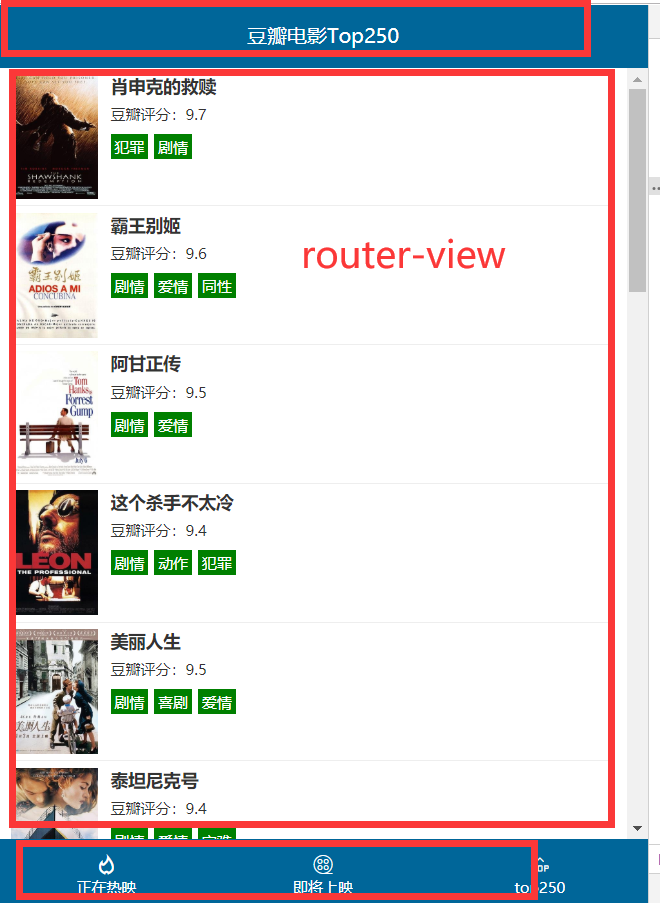
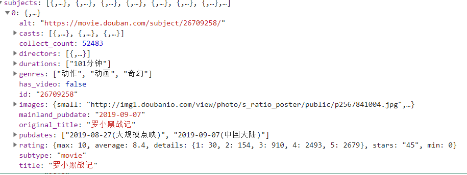
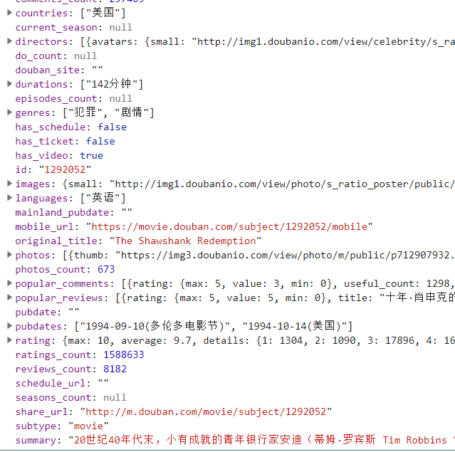

## vuex基础-介绍

​	Vuex 是一个专为 Vue.js 应用程序开发的**状态管理模式**。它采用**`集中式`**存储管理应用的所有组件的状态，并以相应的规则保证状态以一种**`可预测`**的方式发生变化。

- vuex是采用集中式管理组件依赖的共享数据的一个工具，可以解决不同组件数据共享问题。


<font color="red">看图结论：</font>

* 修改 公共状态 **`state`**   => 只能通过 **`mutations `**(集中式修改状态对象)  **`actions`**(异步获取数据)
* 只有通过mutaions方法改的数据才叫响应式数据  => 数据变化  => 视图更新 (组件重新渲染)
* mutations => 里面 只能写 **`同步代码`**   => 不允许做异步请求  => 如果想做异步请求 => 去action中做异步

- state 管理数据，管理的数据是响应式的，当数据改变时驱动视图更新。
- mutations 更新数据，state中的数据只能使用mutations去改变数据。
- actions 请求数据，响应成功后把数据提交给mutations


## vuex基础-初始化功能

* webpack-dev-server  => 启动一个本地服务  => 打的文件 => 内存中
* webpack => 打包  => 物理打包 => 打成真正的文件
* vuex是一个插件  => 但是只能给vuejs用
* vue-router => 路由插件

初始化：

- 第一步：`npm i vuex --save`  => 安装到**`运行时依赖`**   => 项目上线之后依然使用的依赖 ,开发时依赖  => 开发调试时使用  
- 第二步：`import vuex from 'vuex'`
- 第三步：`Vue.use(vuex)`  => 调用了 vuex中的 一个install方法
- 第四步：`const store = new Vuex.Store({...配置项})`
- 第五步：在根实例配置 store 选项指向 store 实例对象

```js
import Vue from 'vue'
import Vuex from 'vuex'
Vue.use(vuex)
const store = new Vuex.Store({})
new Vue({
  el: '#app',
  store
})
```


## vuex基础-state

- 管理数据

```js
// 初始化vuex对象
const store = new vuex.Store({
  state: {
    // 管理数据
    count: 0
  }
})
```

在组件获取state的数据：原始用法插值表达式

```html
<div>A组件 state的数据：{{$store.state.count}}</div>
```

使用计算属性：

```js
// 把state中数据，定义在组件内的计算属性中
  computed: {
    // 1. 最完整的写法
    // count: function () {
    //   return this.$store.state.count
    // },
    // 2. 缩写
    count () {
      return this.$store.state.count
    }
  }
```


## vuex基础-mapState

- 把vuex中的state数据映射到组件的计算属性中。
- **`辅助函数`**，生成计算属性。

导入：

```js
import { mapState } from 'vuex'
```

1. 使用：mapState(对象)  => mapState => 返回一个对象

```JS
  // 使用 mapState 生成计算属性
  computed: mapState({
    // 1. 最原始写法 state vuex中的状态数据
    // count: function (state) {
    //   return state.count
    // },
    // 2. 简写
    // count: state => state.count
    // 3. state字段名称
    count: 'count',
    // 4. 结合使用当前组件的数据  必须申明成普通函数
    myMsg (state) {
      return this.msg + state.count
    }
  })
```

2. 使用：mapState(数组)

```js
//  state字段名称
computed: mapState(['count'])

```

3. 如果组件自己有计算属性，state的字段映射成计算属性

```js
// 如果组件自己有计算属性，state的字段映射成计算属性
  computed: {
    myMsg () {
      return this.msg + '自己计算属性'
    },
    ...mapState(['count'])
  }
```


## vuex基础-mutations

- 修改数据

声明：

```js
  mutations: {
    //  所有的数据修改都应该通过 mutations进行 =>  key(修改的方法名称):value(function(更新函数))
    // payload => 载荷 (运输数据) => 参数 => 可以是任何值  但是一般是 对象  => { 若干参数 }
    addCount (state,payload) {
      // 默认第一个参数是state
      // 对数据进行 加
      state.count += payload.num // 每次自增 传入的数据
      //  state.count++ // 自增1
    },
    cutCount (state, payload) {
      state.count-= payload.num // 自减传入的数据
    }
  }
```

调用：

```js
methods:{
    add () {
      // but这里 能不能直接调用到 store的mutations呢?
      this.$store.commit("addCount", { num: 10 })  // 提交 载荷到mutations
    }
  }
```

* 修改state 必须通过 **`mutations`**

## vuex基础-mapMutations

* 和 mapState的功能类似  => **`简化调用的代码`**

- 把vuex中的mutations的函数映射到组件的methods中
- 通俗：通过mapMutations函数可以生成methods中函数

```js
  methods:{
    add () {
      // but这里 能不能直接调用到 store的mutations呢?
      this.$store.commit("addCount", { num: 10 })  // 提交 载荷到mutations
    },
    ...mapMutations(['addCount', 'cutCount'])  // 字符串数组 =>methods中定义了一个addCount  => store.commit('addCount)
  }
```


## vuex基础-actions

- 异步获取数据

定义：

```js
actions: {
    // context 官方运行上下文   获取当前的vuex实例
    getData (context) {
      // 模拟获取数据的耗时
      setTimeout(() => {
        const data = { num: 8888 }
        // 获取后台的数据成功后
        // 通过mutations去修改数据
        context.commit('increment', data)
      }, 1000)
    },
    // 带传参 params = {num:9999}
    getDataByParams (context, params) {
      // 模拟获取数据的耗时
      setTimeout(() => {
        const data = { num: 8888 }
        // 获取后台的数据成功后
        // 通过mutations去修改数据
        context.commit('increment', data)
      }, 1000)
    }
  }
```

使用：

```js
getData () {
    // 发请求获取数据
    this.$store.dispatch('getData')
    this.$store.dispatch('getDataByParams', { num: 9999 })
},
```


## vuex基础-mapActions

* mapState(把数据给计算属性), mapMutations(把方法给methods), mapActions(把方法给 methods)

- mapAction s辅助函数，把actions中的函数映射组件methods中
- 通俗：通过mapActions函数可以生成methods中函数

```js
// 在methods中申明了一个函数getCount，执行的代码是：this.$store.dispatch('getData')
    ...mapActions({ getCount: 'getData' }),
    // 在methods中申明了一个函数getDataByParams({ num: `9999 })，执行的代码是：this.$store.dispatch('getDataByParams', { num: 9999 })
    ...mapActions(['getDataByParams']),
```


* vuex => **`管理共享状态的框架`**

* **`state`**  =>公共数据

* **`mutations`** => 修改数据  => 必须是同步 ,如果有异步 放在actions中

* **`actions`** => 异步获取数据

  actions => 获取数据  =>  方法(context/store)  =>store.commit   => mutations (更新数据) => state => render => 组件

  组件  =>   action =>  this.$store.dispatch(调用action方法)  => 可以传参吗?  可以!!!!

  action方法  => 第一个参数 是 context => store的运行实例 => this.$store, 第二个参数开始 就是传递的参数

## vuex案例-豆瓣接口

豆瓣接口地址支持jsonp但是不支持**`cors`**。 => 

* cors跨域 设置  => allow => 允许所有接口访问  => 后端设置
* jsonp => 请求 =>必须用jsonp来访问 => 不能axios

- http://api.douban.com/v2/movie/subject/:id  详情
- http://api.douban.com/v2/movie/in_theaters  正在热映
- http://api.douban.com/v2/movie/coming_soon  即将上映
- http://api.douban.com/v2/movie/top250  top250

注意：

- 豆瓣的接口请求限制，每个外网IP有请求次数限制。
- 豆瓣的图片访问显示，非豆瓣域名下发起的图片请求不给予响应。=> 代理服务器解决  => 代理服务器
- 近期：官方停用搜索相关接口，必须要注册豆瓣api平台获取认证apikey才行。
- 网友提供 `apikey=0df993c66c0c636e29ecbb5344252a4a`  <font color="red">大家慎用</font>


## vuex案例-搭建项目

> 通过vue-cli脚手架搭建项目

```bash 
$ vue create douban  #创建项目
```

> 选择  vuex / router /eslint / pre-cssprocesser

创建完毕之后,将豆瓣静态资源的样式 放置在style中,并在main.js中引入

```js
import './styles/css/global.css'
import './styles/fonts/iconfont.css'
```

> 接下来根据页面的布局封装 组件



> 首先封装 头部组件 layout-header.vue  和底部组件 layout-footer.vue, 并在App.vue中使用

```vue
  <div id="app">
    <LayoutHeader />
    <router-view/>
    <LayoutFooter />
  </div>
```

> 封装四个路由组件 

- 正在热映
- 即将上映
- top250
- 电影详情

> 路由规则如下

```js
// 路由规则
  routes: [
    { path: '/', redirect: '/hot' },
    { path: '/hot', component: Hot },
    { path: '/movie', component: Movie },
    { path: '/top', component: Top },
    { path: '/detail', component: Detail }
  ]
```

> 封装一个公共的list组件 movie-list  内部放置豆瓣列表

```vue
<template>
  <div class="wrapper">
        <ul class="list">
          <li>
            <a href="./item.html">
              
              <div class="info">
                <h3>徒手攀岩</h3>
                <p>豆瓣评分：9</p>
                <p><span class="tag">纪录片</span></p>
              </div>
            </a>
          </li>
        </ul>
      </div>
</template>

<script>
export default {

}
</script>

<style>

</style>

```

> 修改底部的导航

```vue
<div class="my-footer">
        <ul>
          <router-link to='/hot' tag="li">
            <a>
              <span class="iconfont icon-remen"></span>
              <p>正在热映</p>
            </a>
          </router-link>
          <router-link to='/movie' tag="li">
            <a>
              <span class="iconfont icon-dianying"></span>
              <p>即将上映</p>
            </a>
          </router-link>
          <router-link to="/top" tag="li">
            <a>
              <span class="iconfont icon-top"></span>
              <p>top250</p>
            </a>
          </router-link>
        </ul>
      </div>
```

## vuex案例-电影列表功能

第一步：声明数据，根据页面需要的数据进行声明。=> vuex => state

* state
*  mutations
* actions

```js
  state: {
    title: '',
    list: []
  },
```

第二步：定义修改数据的方法

```js
        mutations: {
            // 更新state必须通过 mutations
            updateListAndTitle (state, payload) {
                state.title = payload.title
                state.list  = payload.list
            }
        },
```

第三步：获取数据的方法

* 使用jsonp插件

* ```bash
  $  npm i jsonp -S
  ```

  > 异步获取数据 需要用action

```js
    actions: { 
        // 从豆瓣获取数据  接口  jsonp
        // 豆瓣接口 后台未设置支持跨域  但是 支持jsonp
        // jsonp插件  context => store实例  从第二个参数开始就是 传递的参数
        getListFromDouBan (context, type) {
            // jsonp('http://api.douban.com/v2/movie/' + type)
            jsonp(`http://api.douban.com/v2/movie/${type}?apikey=0df993c66c0c636e29ecbb5344252a4a`,function(error ,data){
                if(error) return;
                // 正常逻辑
               // console.log(data)
                context.commit('updateListAndTitle', {title: data.title, list: data.subjects  })
            })
        }
    }
```

第四步：调用获取数据的方法

```js
  methods: {
    ...mapActions(['getListFromDouBan'])  // methods定义了 getListFromDouBan => dispatch.getListFromDouBan
  }
}
```

```js
  created(){
    // 一进入页面就开始调用获取数据的方法
    // this.$store.dispatch('getListFromDouBan')
    this.getListFromDouBan('in_theaters')
  },
```

第五步：获取vuex的数据

```js
computed: {
    ...mapState(['list'])
  },
```

第六步：渲染页面



```html
<ul class="list">
    <li v-for="item in list" :key="item.id">
      <a href="#">
        
        <div class="info">
          <h3>{{item.title}}</h3>
          <p>豆瓣评分：{{item.rating.average}}</p>
          <p><span v-for="(item,i) in item.genres" :key="i" class="tag">{{item}}</span></p>
        </div>
      </a>
    </li>
  </ul>
```


## vuex案例-电影详情功能

- 电影列表  电影的详情地址   都不一样   都会来到电影详情组件
  - 使用动态路由功能  /detail/:id  
  - 电影详情组件获取id获取详情数据

第一步：路由规则

```js
{ path: '/detail/:id', component: Detail }
```

```js
router-link :to="{path:'/detail/'+item.id}"
```

第二步：准备数据

```js
state: {
    // 标题
    title: '',
    // 详情
    item: null
  },
```

第三步：修改数据函数

```js
mutations: {
    // payload = {title,item}  约定数据格式
    updateDetail (state, payload) {
      state.title = payload.title
      state.detail = payload.detail
    }
  },
```

第四步：获取数据去修改数据的函数

```js
 actions: {
    // 获取数据 详情
    getDetail (context, id) {
      jsonp(`http://api.douban.com/v2/movie/subject/:${id}`, function (error, data) {
        if (error) return false
        context.commit('updateDetail', {
          title: data.title,
          detail: data
        })
      })
    }
  }
```

第五步：在组件使用数据

```js
computed: {
    ...mapState(['detail'])
  },
```

第六步：在组件初始化获取数据

```js
created () {
    this.getItemData(this.$route.params.id)
  },
```

```js
  methods: {
    ...mapActions(['getDetail'])
  }
```

第七步：渲染页面



```html
<div class="item" v-if="item">
    
    <div>
      <p>豆瓣评分：{{item.rating.average}}</p>
      <p>产地：{{item.countries[0]}}</p>
      <p><span v-for="(item,i) in item.genres" :key="i" class="tag">{{item}}</span></p>
      <p>{{item.summary}}</p>
    </div>
  </div>
```

处理：空数据报错问题

```js
 <div class="item" v-if="item">
```

