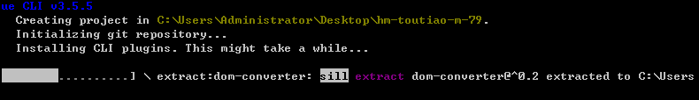

## 项目介绍

- 首先，黑马头条移动端是一个IT资讯移动web应用，有着和**`今日头条`**一样的资讯浏览体验。

- 主要功能：资讯列表、标签页切换，文章举报，频道管理、离线频道，文章详情、阅读记忆，关注功能、点赞功能、评论功能、回复评论、搜索功能、登录功能、个人中心、编辑资料、小智同学、~~问答功能~~、~~视频功能~~ ...   

- 最后，黑马头条可打包成一款移动APP，后期结合H5+可在Dcloud打包成一款体验较好的手机应用。


## 使用技术

-  生产依赖
  - vuejs  核心vue
  - vuex  状态管理插件
  - vue-router  路由插件
  - axios  请求插件
  - json-bigint 最大安全数值处理  =》处理数据精度 =》 axios拦截器 => transformResponse() 
  - socket.io-client  即时通讯库  => 小智同学  => websocket  => 即时通信 
  - vant 移动组件库=> PC =>elemenUI   Vant =>移动端
  - amfe-flexible  rem适配
  - vue-lazyload 图片懒加载 => 图片懒加载
- 开发依赖
  - babel  ES转换器  => es6 =>  es5
  - less  css预处理器
  - postcss  css后处理器 => display:flex;   => 
  - vue-cli  vue项目脚手架
- 打包App
  - H5+  native接口
  - DCLOUD 打包


## 创建项目

* 为什么会丢失core-js ? 创建项目 用的yarn , 安装包 用的npm  => 造成丢包

* 如果没有办法 用powershell调用 vue脚手架命令,可尝试如下操作

* 用管理员模式打开powershell

* 在窗口中输入 如下命令

* ```bash
  set-ExecutionPolicy RemoteSigned
  ```

* 回车之后,在窗口中输入Y, 即可解决该问题

创建项目：

```sh
vue create hm-toutiao-m-94
```

自定义创建：


依赖插件：


路由是否使用history模式：需要额外的服务器配置


预处理器:


语法风格：


风格检查：


存储插件配置位置：


是否记录操作：


正在创建：



创建完毕启动项目：


## 调整结构

* 删除一些没用的文件

调整src目录：

```sh
├─api   #接口函数 请求模块的
├─assets  #静态资源 
├─components  #公用组件
├─styles #less代码 全局样式 
├─utils #工具模块 
└─views #路由页面 组件
    ├─home #首页模块
    ├─login #登录模块
    ├─article #文章模块
    ├─video #视频模块
    ├─question #问答模块
    ├─search #搜索模块
    ├─user #用户模块
    └─layout #公用布局
├─App.vue #根组件
├─router.js #路由文件
└─store.js #状态文件
```

* gitBash  =>  当 提示信息 是 红色  => 表示该修改在工作区 
* gitBash  =>  当 提示信息 是 绿色  => 表示该修改在暂存区     
* 老高  => 给同学们一份仓库地址  =>  同学 git  clone 地址  => 只需要一次
* 老高 => 提交 ,推送  同学 git  pull   =>  同学 建立自己的远程仓库  => 每天push到自己的仓库上

## 版本控制

1. 创建远程仓库,必须有一个gitHub账号

```sh
# （空）仓库地址
https://github.com/shuiruohanyu/94-heima-mobile.git
```

2. 提交

```sh
git add .
git commit -m '初始化'
```

3. 推送远程仓库

```sh
# 加别名origin
git remote add origin <远程仓库地址>
# 推送记录操作  -u的意思是 记住当前推送的是哪个分支 哪个地址
git push -u origin master
```

注明：不再采用分支来管理，按功能提交即可。用master分支

同学 每天拉代码 

```bash 
$ git pull
```


## 使用vant

* Vue移动组件库  => 有赞   => 更新维护快
* Vue PC组件  =>  饿了么  => 更新维护快

- 官方地址：https://youzan.github.io/vant/#/zh-CN/intro
- 安装：

```sh
npm i vant -S
```

- 导入：在main.js导入

```js
import Vue from 'vue';
import Vant from 'vant';
import 'vant/lib/index.css';

Vue.use(Vant);  // 全局注册  实际上调用了 Vant导出的对象的方法  install方法
```

以上做法是完整导入，在项目开发阶段使用，配置方便节省时间，将来上线的时候可以使用按需导入。

按需引入  => 用哪个组件就注册哪个组件 ,没有必要在开发阶段 做, 

在性能优化阶段做 按需引入最佳


## REM适配

https://blog.csdn.net/Jason_Maron/article/details/90200807  npm 和 yarn的比较

| npm init                   | yarn init                 | 初始化某个项目                         |
| -------------------------- | ------------------------- | -------------------------------------- |
| npm install/link           | yarn install/link         | 默认的安装依赖操作                     |
| npm install taco —save     | yarn add taco             | 安装某个依赖，并且默认保存到package.   |
| npm uninstall taco —save   | yarn remove taco          | 移除某个依赖项目                       |
| npm install taco —save-dev | yarn add taco —dev        | 安装某个开发时依赖项目                 |
| npm update taco —save      | yarn upgrade taco         | 更新某个依赖项目                       |
| npm install taco --global  | yarn global add taco      | 安装某个全局依赖项目                   |
| npm publish/login/logout   | yarn publish/login/logout | 发布/登录/登出，一系列NPM Registry操作 |
| npm run/test               | yarn run/test             | 运行某个命令                           |

 

Vant 中的样式默认使用`px`作为单位，如果需要使用`rem`单位，推荐使用以下两个工具

- [postcss-pxtorem](https://github.com/cuth/postcss-pxtorem) 是一款 postcss 插件，用于将单位转化为 rem,我们开发时,原来怎么写 现在还怎么写,会自动转成rem  
- font-size: 30px =>  font-size: 30px /基准值 rem
- [lib-flexible](https://github.com/amfe/lib-flexible) 用于**`动态设置`** rem 基准值

首先，需要安装：

```sh
# 后处理器 开发阶段使用 
$ npm i postcss-pxtorem -D
$  yarn add  postcss-pxtorem --dev
# 修改rem基准值的js插件   需要在打包后需要使用
$ npm i amfe-flexible -S  #因为 需要在运行时 实时改变 font-size大小 根据屏幕
$ yarn add amfe-flexible 
```

 webpack => webpack.config.js

postcss => postcss.config.js

然后，下面提供了一份基本的 postcss 配置（postcss.config.js），可以在此配置的基础上根据项目需求进行修改

```diff
module.exports = {
  plugins: {
    'autoprefixer': {},
+    'postcss-pxtorem': {
+      rootValue: 37.5,
+      propList: ['*']
+    }
  }
}
```

最后，入口文件main.js导入 amfe-flexible 

import  变量  from 地址 

import  地址

```js
import 'amfe-flexible'
```

注意

- rootValue 是转换px的基准值，参考设备iPhone6，设备宽度375px。
- flexible 在iPhone6设备设置的  html--->font-size 也为37.5px 。
- 但是 设计稿 尺寸750px 大小，所以在设计稿量取的尺寸使用时候需要  **除以2**  。


